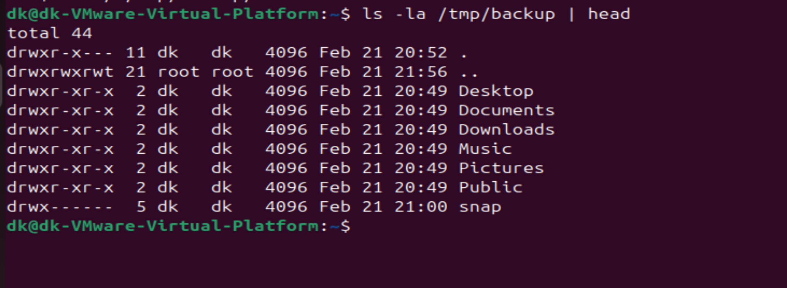
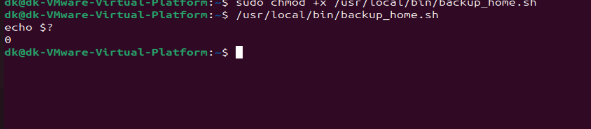

# Домашнее задание к занятию 3 «Резервное копирование»
**Выполнил:** Daniil Solonko

## Задание 1 — зеркальная копия домашней директории в `/tmp/backup`

Команда rsync (зеркало, исключение скрытых каталогов/файлов, сравнение по checksum):

```bash
rsync -a --delete --checksum \
  --exclude='.*' \
  --exclude='*/.*' \
  "$HOME"/ /tmp/backup/
```
## Задание 2 — регулярное резервное копирование (rsync + cron)

**Цель:** настроить ежедневное зеркальное резервное копирование домашней директории пользователя в `/tmp/backup` с логированием результата в системный лог.

### 1) Скрипт резервного копирования
Создан скрипт `/usr/local/bin/backup_home.sh`, который:
- создаёт `/tmp/backup` (если нет);
- выполняет **зеркальную** синхронизацию (`--delete`);
- исключает скрытые файлы/директории (начинающиеся с `.`);
- сравнивает файлы по **хеш-суммам** (`--checksum`);
- пишет в системный лог запись об успешном завершении через `logger`.

Файл скрипта добавлен в репозиторий: `backup_home.sh`.

### 2) Настройка cron
Создана задача cron, запускающая скрипт **1 раз в день** (в 01:00).
При ошибке выполнения дополнительно создаётся запись в системном логе через `logger`.

Текущий crontab сохранён в репозиторий файлом `crontab.txt`.

Строка cron:
```cron
0 1 * * * /usr/local/bin/backup_home.sh || logger -t backup_home "ERROR: backup failed (exit $?)"
```


